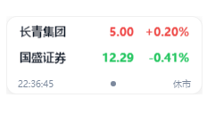
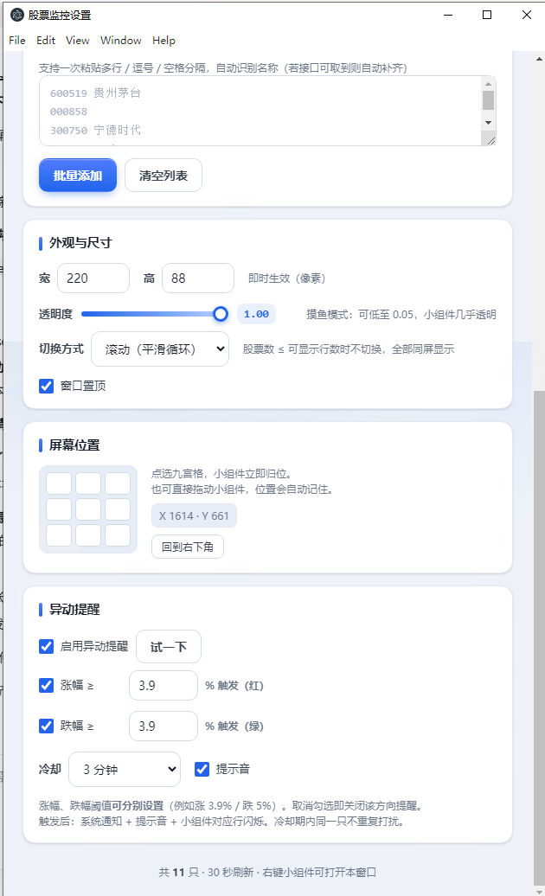

<div align="center">


# Marketmonitor

**Windows 桌面常驻的 A 股股票悬浮小组件** —— 多股同屏、实时行情、异动提醒，透明度 / 位置 / 尺寸全部可调，右键即配置，装完即用。

**v1.3.0 · MIT License · 无需账号 · 免费无 Key**

</div>

---

## ✨ 它是什么

一个常驻在 Windows 桌面（默认右下角）的透明小卡片，实时显示你自选股票的**名称 / 现价 / 涨跌幅**：

- 多只股票同屏，可**平滑滚动**或**逐页跳动**两种展示方式自由切换
- 涨用**红**、跌用**绿**（遵循 A 股惯例）
- 后台每 30 秒静默刷新一次实时行情，全程不打断你
- 完全透明可叠加在任意窗口之上，或调成半透明"摸鱼"不刺眼

## 🖼 预览

**实时显示** —— 常驻桌面的小卡片，实时行情 + 休市状态：



**设置界面** —— 右键卡片即可打开，股票 / 外观 / 位置 / 异动提醒一键配置：



## 🚀 安装（最简单）

1. 到 [Releases](../../releases) 页面，下载最新的 `Marketmonitor-Setup-x.x.x.exe`（一键安装包，约 70MB）。
2. 双击 → 自动安装到当前用户目录（**无需管理员权限**）→ 自动生成**桌面 + 开始菜单**快捷方式 → 装完自动启动。
3. 想卸载：设置 → 应用 → 搜 "Marketmonitor" → 卸载即可（会一并清理配置）。

> 便携版不安装、免依赖，也可以直接把发布包里的程序文件夹拷到任意 U 盘即插即用。

## ⚙️ 功能一览

| 功能 | 说明 |
|------|------|
| 📈 自选股管理 | 输入 `600519` 或 `sh600519` 自动识别沪深；支持批量粘贴（逗号/空格/换行）自动提取 6 位代码 |
| 🔔 异动提醒 | 涨幅/跌幅**分别设置**阈值（默认各 3.9%），触发时系统通知 + 提示音 + 卡片闪烁，冷却去重不刷屏 |
| 🎚 透明度 | 0.05–1.0 可调，**只淡背景、文字恒清晰**（低透明度下自动收敛光晕，不发虚）|
| 📐 尺寸 | 宽 / 高**双向实时**生效，高度决定同屏行数（高 140≈3 行，高 400≈12+ 行）|
| 🧭 屏幕位置 | 九宫格一键归位（左上 / 正中 / 右下 ……），也可随意拖动；**默认右下角** |
| 🔄 展示方式 | `滚动` 平滑位移 / `跳动` 整页切换，实时切换 |
| 📌 置顶 | 一键让小组件常在最上层 |
| 🖱 拖拽 | 按住卡片任意非按钮区域拖动到任意位置，松手自动保存，下次启动仍在原地 |
| ⏸ 异动冷却 | 提醒防抖（默认 3 分钟），避免同一异动反复轰炸 |

## 🖲 常用操作

| 操作 | 效果 |
|------|------|
| 按住卡片拖动 | 移动位置（自动记忆）|
| **右键卡片** | 打开设置页 |
| 托盘图标 **左键** | 显示 / 隐藏卡片 |
| 托盘图标 **右键** | 显示/隐藏 / 打开设置 / 立即刷新 / 退出 |

> 所有设置即时写入 `config.ini` 并持久化，重启后保留。

## 🧩 技术栈

- **Electron 31** + 原生 HTML / CSS / JS（**零前端框架**，包体小、无依赖地狱）
- 数据源：腾讯财经行情接口 `qt.gtimg.cn`（免费、无需注册、无需 Key）
- 存储：纯 `config.ini`（INI 文本），随程序目录走，天然便携
- 打包：electron-builder（NSIS 一键安装包 / 便携包）

## 🏗 从源码构建

```bash
# 1. 安装依赖（会自动拉 Electron）
npm install

# 2. 本地运行调试
npm start

# 3. 打一键安装包（得到 dist/Marketmonitor-Setup-x.x.x.exe）
npm run dist
```

> 构建目标为 Windows x64。

> 🤖 **不用自己构建也行**：仓库已配置 GitHub Actions 自动构建（`.github/workflows/build.yml`），每次 push / 打 tag 都会在云端自动生成 Windows 安装包，产物可在 **Actions** 页下载。

## 📁 文件结构

```
marketmonitor/
├── .github/workflows/
│   └── build.yml           # CI：push / tag 自动构建 Windows 安装包
├── package.json            # 依赖 + electron-builder 打包配置
├── package-lock.json       # 锁文件（可复现构建）
├── main.js                 # Electron 主进程（窗口 / 托盘 / 行情抓取 / 提醒引擎 / 尺寸守卫）
├── preload.js              # contextBridge IPC 桥（安全隔离）
├── renderer/
│   ├── index.html          # 小组件主界面
│   ├── renderer.js         # 渲染层逻辑（滚动/跳动/亮度/拖拽）
│   ├── style.css           # 小组件样式（透明度只作用于背景）
│   ├── settings.html       # 设置页（个股/提醒/透明度/尺寸/位置）
│   ├── settings.css
│   └── settings.js
└── assets/
    └── icon.png / icon.ico / icon_256.png
```

## ⚠️ 已知限制

- 北交所（4 / 8 开头）代码需手动加前缀（如 `bj430047`）
- 停牌股票显示最后一次有效数据
- 无网络时占位为 `--`，恢复后自动刷新
- 仅在 Windows x64 上验证过；macOS / Linux 未专门适配（透明无边框窗口行为可能有差异）

## ❤️ 写在最后

**这是 AI 从零搓出来的程序。**

从最初只有两行滚动的简陋卡片，到现在的异动提醒、透明度、尺寸双向调节、九宫格定位、一键安装包——每一条功能都是 AI 一步步落地、再反复修 bug 磨出来的。

其实我心里一直想换**体积更小**的技术方案（比如 Tauri），可这台电脑的硬盘实在太小，装不下那些开发支持文件和依赖，折腾几轮都跑不起来。最后就用 Electron 把这版本做扎实了——**这个版本，也不错。**

记录一下，分享给同样想"让 AI 帮我把一个小工具做出来"的朋友。

## 📄 License

[MIT](LICENSE) © 2026 (yohoky)
